# Summary

Model-based clustering methods allow a large number of correlated variables to be summarized into underlying patterns, where each pattern describes a cluster and each individual is assigned to a cluster. Example applications include identifying dietary patterns from dietary intake data [@stephenson2020empirically] and creating profiles of health and development among children [@lanza2016latent]. Bayesian formulations of such analyses allow the number of clusters to be determined by the data rather than through researcher post-hoc analyses.

Interest may also lie in relating the identified clusters to an outcome, either through a secondary regression step or an all-in-one "supervised" approach that uses information from the outcome to inform the clustering process. When such clustering methods are applied to survey data, failure to account for the complex survey design and incorporate survey weights into the estimation leads to biased estimation and inference when the results are generalized to the population outside of the survey data.

The `baysc` R package implements the methods proposed in @stephenson2023identifying and @wu2024derivation, providing functionality to allow for Bayesian clustering analyses – both unsupervised and supervised – to be performed while incorporating survey weights and design features that account for complex survey sampling designs. Asymptotically correct point estimates and credible intervals are produced with respect to the underlying population from which the observed sample was generated. This novel feature allows for application of latent class analysis (LCA) to datasets realized from surveys administered by government statistical agencies. The package uses methods derived from the LCA literature and focuses on clustering in the setting where the correlated variables are categorical and the outcome, where applicable, is binary. The package includes additional functions for plotting and summarizing output, as well as an example dataset from the National Health and Nutrition Examination Survey (NHANES) containing dietary intake and hypertension data among low-income women in the United States [@nchs2023homepage].

# Statement of Need

A number of R packages provide functionality for model-based clustering in R. Frequentist approaches include `poLCA` [@linzer2011polca] for classical LCA, `randomLCA` [@beath2017randomlca] for LCA with individual-specific random effects, and `mclust` [@scrucca2023model] and `tidyLPA` [@rosenberg2019tidylpa] for clustering of continuous variables. `BayesLCA` [@white2014bayeslca] and `BayesBinMix` [@papastamoulis2017bayesbinmix] use Bayesian approaches for categorical and binary data, respectively. `PReMiuM` [@liverani2015premium] fits a wide variety of supervised models that handle various types of discrete and continuous exposure and outcome data. However, these packages do not allow for survey weights and complex survey design to be incorporated to ensure valid estimation and inference when using survey data.

The `baysc` package implements a weighted pseudo-likelihood approach proposed in @stephenson2023identifying and @wu2024derivation that can integrate survey sampling weights when performing cluster analysis using categorical or binary data. The models adjust for stratification, clustering, and informative sampling to provide accurate point and variance estimation. When interest lies in how clusters are related to additional variables, such as a binary outcome, users can either: 1) adopt a two-step approach where unsupervised clustering is performed and then a secondary regression is fit, or 2) use the all-in-one supervised approach that jointly models all variables, precisely propagating measurement error from the clustering analysis into the outcome regression model. The supervised approach also uses a mixture reference coding scheme to allow interaction effects between the clusters and the outcome to be captured. Detailed information about the functions and related statistical details can be found in the vignette, "[An introduction to the baysc package](https://raw.githubusercontent.com/smwu/baysc/refs/heads/main/vignettes/baysc.pdf)," and @wu2024derivation.

# Usage

## Package Installation

The `baysc` package can be installed from GitHub.

``` r
# Install devtools for package loading 
install.packages(devtools)
library(devtools)
# Install baysc from GitHub
devtools::install_github("smwu/baysc")
library(baysc)
# Load other packages needed for the examples
library(dplyr)
library(ggplot2)
library(knitr)
```

During installation, the following errors may arise:

-   *No package called 'rstantools'*: Please install the `rstantools` package using `install.packages("rstantools")`.
-   *Library 'gfortran' not found*: This is a compiler configuration issue that can arise when using Rcpp on Mac computers with Apple silicon (e.g., M1, M2, M3). Users may need to install Xcode, GNU Fortran, and OpenMP, and edit the `~/.R/Makevars` file. More details are provided in the GitHub README file.

## Data preparation

`baysc` applies Bayesian latent class analysis using the following input data:

-   Multivariate categorical exposure: $nxJ$ matrix, where $n$ is the sample size and $J$ is the number of categorical item variables. Each item must be a categorical variable with levels 1, 2, etc.
-   (Optional) survey design elements such as survey sampling weights, stratum indicators, and cluster indicators: each formatted as a $nx1$ vector.
-   (Optional) binary outcome: $nx1$ vector
-   (Optional) additional confounders to adjust for when evaluating the exposure-outcome association: $nxQ$ dataframe, where $Q$ is the number of additional confounders.

We provide an example dataset from the National Health and Nutrition Examination Survey (NHANES) that includes multivariate categorical dietary intake data as well as binary hypertension data for low-income women in the United States. Survey sampling weights and information on stratification and clustering are included to allow for adjustment for survey design when conducting estimation and inference.

### Load dataset and define categorical item variables

We begin by loading the example dataset included in the package. Then, we define the matrix of categorical variables that will be used for the clustering analysis. In this example, we have a sample size of $n=2004$ and consider $J=28$ food groups, each of which is a categorical variables with four levels of intake: 1, 2, 3, 4.

``` r
# Load NHANES example dataset
data("data_nhanes")

# Exposure matrix of categorical intake for each individual across 
# 28 food groups
x_mat <- data_nhanes[, c("citrus", "oth_fruit", "fruit_juice", "dark_green", 
  "tomatoes", "oth_red", "potatoes", "oth_starchy", "oth_veg", "whole_grain", 
  "ref_grain", "meat", "cured_meats", "organ", "poultry", "seafood_high", 
  "seafood_low", "eggs", "soybean", "nuts", "leg_protein", "milk", "yogurt", 
  "cheese", "oils", "solid_fats", "add_sugars", "drinks")]
x_mat <- as.matrix(x_mat)
# Dimensions of exposure matrix, n x J
dim(x_mat)
```

```         
[1] 2004   28
```

``` r
# Categorical intake levels
table(x_mat[, "citrus"])
```

```         
   1    2    3    4 
1121  296  287  300 
```

### Define survey design variables

Next, we define the survey design variables specifying information on stratification, clustered sampling, and sampling weights that adjust for unequal sampling probabilities. For the cluster indicators, use indicators for the first stage of sampling and do not nest the indicators within strata. The variance computation will only use the first stage of clustering and will assume sampling to be with replacement at the first stage.

If there is no survey design information, these variables can be left as `NULL` (default).

``` r
# Survey stratum indicators
stratum_id <- data_nhanes$stratum_id
# Survey cluster indicators
cluster_id <- data_nhanes$cluster_id
# Survey sampling weights
sampling_wt <- data_nhanes$sample_wt
```

### Define outcome and additional regression variables

If desired, a binary outcome can be added to examine the association between the clusters and the outcome. In this example, the outcome is hypertension (i.e., high blood pressure; `BP_flag` variable), with 1 indicating hypertension and 0 indicating no hypertension.

``` r
# Outcome data on hypertension 
y_all <- data_nhanes$BP_flag
```

If there are additional covariates that should be adjusted for in the exposure-outcome association, they can be specified in a dataframe of additional confounders to adjust for. Also define a regression formula for including these additional confounders. In this example, for the diet-hypertension outcome regression, we adjust for age, race/ethnicity, smoking status, and physical activity. Note that the regression formula here should be specified *without* including the outcome, unlike in other regression functions.

``` r
# Create dataframe of additional confounders
V_data <- data_nhanes %>% select(age_cat, racethnic, smoker, physactive)
# Regression formula for additional confounders
glm_form <- "~ age_cat + racethnic + smoker + physactive"
```

## Model fitting

Two options exist for running a survey-weighted Bayesian clustering analysis: 1) use just the categorical variables to perform unsupervised clustering, then decide later on whether these will be related to other variables (e.g., a binary outcome) via a regression model; 2) use a supervised clustering model that jointly models the categorical variables and a binary outcome to perform outcome-informed clustering while characterizing the cluster-outcome association simultaneously. The first model is called a Weighted Overfitted Latent Class Analysis (WOLCA), and the second option is called a Supervised Weighted Overfitted Latent Class Analysis (SWOLCA). See @wu2024derivation for statistical details of the models.

In both options, parameter estimation for the clustering analysis is obtained via a Markov chain Monte Carlo (MCMC) Gibbs sampling algorithm. Sampling is implemented in two stages: an adaptive sampler followed by a fixed sampler. The adaptive sampler is used to determine the number of latent classes using a data-driven process with a sparsity-inducing Dirichlet prior. Once the number of latent classes is determined, the fixed sampler is run using the set number of classes and produces output for estimation and inference. Note that the final number of classes determined by the fixed sampler may be smaller than the number of classes obtained from the adaptive sampler.

In the sections below, we provide examples of how to use the WOLCA and SWOLCA clustering methods in the package. Options are provided for the main input arguments, but additional parameters for prior specification and other customization are available — please see the documentation help pages for the functions.

### Option 1: Use WOLCA to perform unsupervised clustering

#### Clustering analysis

If no outcome information is necessary when clustering, use the unsupervised WOLCA, implemented in the `wolca()` function, to obtain clusters and pattern profiles.

In this example, we specify the categorical variables for clustering (`x_mat`) as well as the survey design variables (`sampling_wt`, `cluster_id`, `stratum_id`). We run the sampler for `n_runs = 300` iterations, discarding initial iterations as burn-in (`burn = 150`), thinning to every third iteration (`thin = 3`), and printing out a progress update every 20 iterations (`update = 20`). Typically, at least 20000 iterations should be used for `wolca()`, corresponding to a runtime of around 2 hours.

We run both the adaptive and fixed sampler (`run_sampler = "both"`) and set a seed (`adapt_seed = 111`). Other options are `"adapt"` for only the adaptive sampler, or `"fixed"` for only the fixed sampler when the number of latent classes is known a priori. The maximum number of latent classes is set to 30 (`K_max = 30`). Typically, the true number will be much smaller and will be determined by the data through the sparsity-inducing Dirichet prior. The minimum size of each latent class is set to 5% of the population (`class_cutoff = 0.05`).

We specify `save_res = FALSE` here because the results do not need to be saved for this example. If `save_res = TRUE` (default), `save_path` must also be specified and include both the desired directory and the beginning of the file name for the results (e.g., `save_path = "~/Documents/run"`).

``` r
# Run WOLCA to perform clustering analysis
res_wolca <- wolca(x_mat = x_mat, sampling_wt = sampling_wt,
                   cluster_id = cluster_id, stratum_id = stratum_id,
                   run_sampler = "both", K_max = 30, adapt_seed = 111, 
                   class_cutoff = 0.05, n_runs = 300, burn = 150, thin = 3, 
                   update = 20, save_res = FALSE)
```

#### Variance adjustment

After performing the clustering analysis, the `wolca_var_adjust()` function can be used to apply a post-processing adjustment that allows for correct estimation of the variability of the parameter estimates. If this adjustment is not applied, the estimated variances will be too small. However, if the user is only interested in estimation of the patterns, these results will be valid regardless of whether this adjustment is applied.

For this example, we set a random seed for reproducibility (`adjust_seed = 111`) and use 100 bootstrap replicates (`num_reps = 100`) to estimate variability in the sampling process. Again, we choose not to save results.

Users can ignore the following warning messages: "the design is sampled with replacement and only the first stage is used" and "the number of chains being less than 1 and sampling not done." Messages about negative variances and large (\>1) eigenvalue differences to the nearest positive definite matrix indicate instability in the variance adjustment matrix inversions. Methods to address this issue include running the sampler for more iterations or reducing the number of additional covariate terms in the outcome regression. One could also choose to forgo the variance adjustment and simply use the posterior distributions produced by `wolca()`, acknowledging that estimated variances will be slight underestimates.

``` r
# Apply variance adjustment
res_wolca_adjust <- wolca_var_adjust(res = res_wolca, adjust_seed = 111,
                                     num_reps = 100, save_res = FALSE)
```

#### Outcome association

Next, we can use `wolca_svyglm()` to examine the association of pattern profiles with the binary outcome of hypertension through a subsequent regression model. This step involves a survey-weighted probit regression model using the `svyglm()` function in the `survey` package [@lumley2023survey]. One word of caution: this approach can result in imprecise estimates and estimates that are attenuated due to the measurement error in the first classification step that is unaccounted for. See @nylund2019prediction for more discussion of this issue. To resolve this issue, users can consider using multiple imputation approaches to draw from the posterior class probabilities. However, these are not yet implemented in the `baysc` package functionality.

If models other than probit regression are of interest, users can take the `wolca()` or `wolca_var_adjust()` output and use the `svyglm()` function directly. This will allow specification of a broader range of survey-weighted regression models.

In this example, we use the output from `wolca_var_adjust()`, along with the binary outcome and additional covariates, in order to run a probit regression model. We specify that survey-weighted confidence intervals should be evaluated at the 95% confidence level (`ci_level = 0.95`).

A warning about negative residual degrees of freedom may arise when the survey design degrees of freedom is smaller than the number of covariates in the model. Confidence intervals and p-values are by default not reported in the `svyglm()` function. However, when the covariates are not cluster-level covariates, it is approximately reasonable to use the survey design degrees of freedom instead, which is what the `baysc` package does to calculate confidence intervals and p-values. Please see the `survey` package documentation for more discussion on this issue.

``` r
# Run weighted outcome regression model
res_wolca_svyglm <- wolca_svyglm(res = res_wolca_adjust, y_all = y_all, 
                                 V_data = V_data, glm_form = glm_form, 
                                 ci_level = 0.95, save_res = FALSE)
```

### Option 2: Use SWOLCA to perform supervised clustering

#### Clustering analysis and outcome association

As an alternative to the two-step approach in Option 1, a one-step “supervised” approach allows information about the binary outcome to directly inform the creation of the clusters. We use the `swolca()` function to obtain dietary pattern clusters while simultaneously relating them to the hypertension outcome.

In this example, we specify the categorical variables for clustering (`x_mat`), the outcome and regression variables (`y_all`, `V_data`, `glm_form`), and the survey design variables (`sampling_wt`, `cluster_id`, `stratum_id`). We run the sampler for `n_runs = 300` iterations, discarding initial iterations as burn-in (`burn = 150`), thinning to every third iteration (`thin = 3`), and printing out a progress update every 20 iterations (`update = 20`). Typically, at least 20000 iterations should be used for `swolca()`, corresponding to a runtime of around 3 hours.

We run both the adaptive and fixed sampler (`run_sampler = "both"`) and set a seed (`adapt_seed = 222`). Other options are `"adapt"` for only the adaptive sampler, or `"fixed"` for only the fixed sampler when the number of latent classes is known a priori. The maximum number of latent classes is set to 30 (`K_max = 30`). The minimum size of each latent class is set to 5% of the population (`class_cutoff = 0.05`).

We do not save results for this example (`save_res = FALSE`). If results are to be saved, set `save_res = TRUE` and specify `save_path` by including both the desired directory and the beginning of the file name for the results (e.g., `save_path = "~/Documents/run"`).

Note: if continuous variables are incorporated into the binary probit outcome model, any such variables with standard deviation greater than 5 may result in errors in the variance adjustment. To avoid these errors, consider standardizing the variable to have mean 0 and standard deviation 1 or converting the variable into a categorical form.

``` r
# Run SWOLCA
res_swolca <- swolca(x_mat = x_mat, y_all = y_all, V_data = V_data, 
                     glm_form = glm_form, sampling_wt = sampling_wt, 
                     cluster_id = cluster_id, stratum_id = stratum_id,  
                     run_sampler = "both", K_max = 30, adapt_seed = 222, 
                     class_cutoff = 0.05, n_runs = 300, burn = 150, 
                     thin = 3, update = 20, save_res = FALSE)
```

#### Variance adjustment

The `swolca_var_adjust()` function can be used after to apply a post-processing adjustment that allows for correct estimation of the variability of the parameter estimates. If this adjustment is not applied, the estimated variances will be too small.

For this example, we set a random seed for reproducibility (`adjust_seed = 222`) and use 100 bootstrap replicates (`num_reps = 100`) to estimate variability in the sampling process. Again, we choose not to save results.

When running the variance adjustment, some warning messages may arise to indicate instability in the variance adjustment matrix inversions. Possible solutions include running the sampler for more iterations or reducing the number of additional covariate terms in the outcome regression. If continuous covariates are included in the probit regression model, these errors may also be due to the variance of the covariate being too large. In such cases, it is recommended to reduce the variance of the covariate, either by standardizing the variable to have mean 0 and standard deviation 1, or by transforming the variable into a categorical variable. One could also choose to forgo the variance adjustment and simply use the posterior distributions produced by `swolca()`, acknowledging that estimated variances will be slight underestimates.

``` r
# Apply variance adjustment
res_swolca_adjust <- swolca_var_adjust(res = res_swolca, adjust_seed = 222,
                                       num_reps = 100, save_res = FALSE)
```

## Visualization

We demonstrate plotting and summarization functions for SWOLCA (option 2) using the `res_swolca_adjust` results from running `swolca()` and `swolca_var_adjust()`. The same functions can also be used for summarizing output for WOLCA (option 1) using the results from `wolca()`, `wolca_var_adjust()`, and `wolca_svyglm()`.

### Plot pattern profiles

For each latent class (i.e., cluster), there is a pattern profile defined by the category with the highest posterior probability, also referred to as the modal $\theta$, for each item. To visualize these pattern profiles, use the `plot_pattern_profiles` function with output from `swolca()`, `swolca_var_adjust()`, `wolca()`, or `wolca_var_adjust()`.

We specify labels for the items (`item_labels`), categories (`categ_labels`), and latent classes (`class_labels`), as well as the axis and legend titles (`item_title`, `categ_title`, and `class_title`).

``` r
# Categorical item labels
item_title <- "Item"
item_labels <- c("Citrus/Melon/Berries", "Other Fruits", "Fruit Juice", 
                 "Dark Green Vegs", "Tomatoes", "Oth Red/Orange Vegs",
                 "Potatoes", "Other Starchy Vegs", "Other Vegetables",
                 "Whole Grains", "Refined Grains", "Meat", "Cured Meats",
                 "Organ Meat", "Poultry", "Seafood (High n-3)", 
                 "Seafood (Low n-3)", "Eggs", "Soybean Products", 
                 "Nuts and Seeds", "Legumes (Protein)", "Milk", "Yogurt", 
                 "Cheese", "Oils", "Solid Fats", "Added Sugar",
                 "Alcoholic Drinks")
# Category level labels
categ_title <- "Consumption Level"
categ_labels <- c("None", "Low", "Med", "High")
# Latent class (i.e., cluster) labels
class_title <- "Dietary Pattern"
class_labels <- 1:5

# Get pattern profiles
plot_pattern_profiles(res = res_swolca_adjust, 
                      item_labels = item_labels, item_title = item_title,
                      categ_labels = categ_labels, categ_title = categ_title,
                      class_labels = class_labels, class_title = class_title)
```

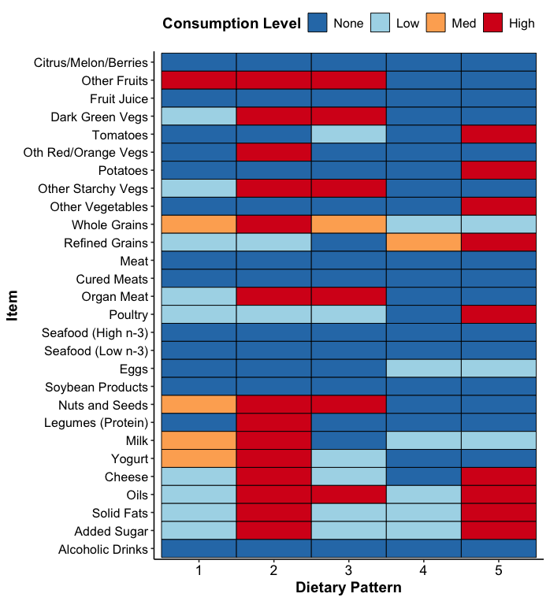{width="60%"}

For the NHANES example using the `swolca()` supervised clustering function, we can interpret these 5 patterns as diet-hypertension patterns where individuals following the same pattern share similar dietary intake and hypertension status. If the `wolca()` unsupervised clustering function had been used, these patterns would be interpreted as solely diet patterns where individuals following the same pattern share similar dietary intake. Since survey design was accounted for, these patterns should be representative of the patterns in the broader population.

### Plot pattern probabilities

To examine to what extent the data support the pattern profiles, we can view the specific distribution of posterior probabilities across the item categories for each item and each class using `plot_pattern_probs()`, with output from `swolca()`, `swolca_var_adjust()`, `wolca()`, or `wolca_var_adjust()`. This allows us to examine how much evidence supports the category with the highest posterior probability compared to the other categories. If there is no evidence supporting one category over the others, then all the probabilities will be equal to $1/R_j$, where $R_j$ is the number of categories for item $j$. For example, the distribution for Other Fruits for Class 2 is pretty even across the 4 consumption levels, indicating that Class 2 still has a fair amount of heterogeneity in consumption of Other Fruits. If the data strongly support a category, the posterior probability for that category will be much closer to 1 (e.g., 0.8). For example, the probability that Organ Meat is consumed at level "None" is very high for those in classes 4 and 5.

``` r
plot_pattern_probs(res = res_swolca_adjust, 
                   item_labels = item_labels,
                   categ_labels = categ_labels) + 
  # font size for item labels
  theme(strip.text.x = element_text(size = 7))  
```

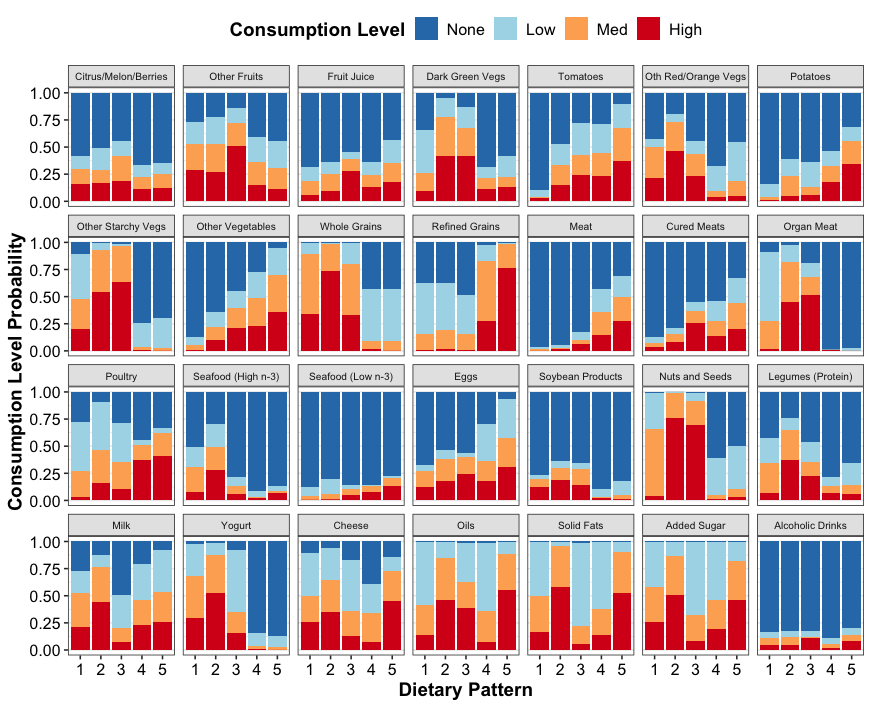{width="100%"}

### Obtain individual class assignments and class separation

For each individual in the sample, we can obtain their final class (i.e., cluster) assignment as well the posterior probability of them belonging to each class. The ability to check posterior class assignment probability is an advantage of model-based clustering and allows us to see the uncertainty associated with the clustering analysis. This information can be used to check class separation metrics such as entropy [@wang2017performance] or the average latent class posterior probability [@muthen2000integrating], both recommended to be above 0.8 for adequate class separation [@weller2020latent]. Note that these metrics are *not* generalizable to the broader population and are limited to describing individuals included in the dataset.

In this example, we can see that individual 1 is assigned to class 1 and individual 2 is assigned to class 2 with very high probabilities (\>0.98), and individual 3 is assigned to class 2 with lower probability (0.793).

``` r
# Class assignments for first 3 individuals
res_swolca_adjust$estimates_adjust$c_all[1:3]
```

```         
[1] 1 2 2
```

``` r
# Posterior class probabilities for first 3 indivs, rounded to 3 decimals
round(res_swolca_adjust$estimates_adjust$pred_class_probs[1:3, ], 3)
```

```         
      [,1]  [,2]  [,3] [,4] [,5]
[1,] 0.981 0.000 0.019    0    0
[2,] 0.010 0.990 0.000    0    0
[3,] 0.207 0.793 0.001    0    0
```

A dendrogram displaying the distances between classes can also be created to check class separation. The distance is the number of MCMC iterations with differing class assignments (after discarding burn-in and thinning). The dendrogram displays the hierarchical clustering setup, where individuals first are all assigned to their own class, and then classes are systematically merged together starting from classes that have the smallest distance between them. The preliminary number of latent classes selected is displayed by the rectangles, with each individual assigned to a class. A final merging step between classes that have the exact same modal pattern was done to merge any duplicate classes. In the below example, we can see that Class 5 is composed of two smaller groups that were merged together.

``` r
# Get dendrogram
dend <- res_swolca_adjust$post_MCMC_out$dendrogram
# Get preliminary number of latent classes
K_med <- res_swolca_adjust$post_MCMC_out$K_med
# Remove labels for individuals to declutter the plot
dend$labels <- ""
# Plot dendrogram
plot(as.dendrogram(dend), ylab = "Distance")
# Rectangles around the latent classes
rect.hclust(dend, k = K_med, border = 2:(2 + K_med - 1))
```

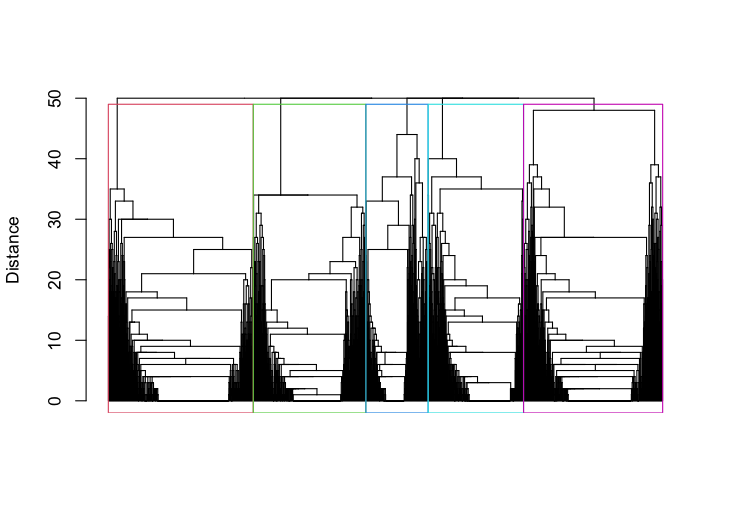{width="50%"}

### Plot distribution of classes

To examine how common the classes are in the broader population, the `plot_class_dist()` function displays boxplots for the estimated proportion of the population belonging to each class (i.e., latent class membership probabilities, $\pi$) across the iterations of the MCMC sampler. In the below example, there is quite a lot of variability in the estimates for classes 1 and 3.

``` r
# Median estimated population class proportions
round(res_swolca_adjust$estimates_adjust$pi_med, 3)
```

```         
[1] 0.196 0.252 0.110 0.185 0.257
```

``` r
# Plot distribution of classes
plot_class_dist(res = res_swolca_adjust)
```

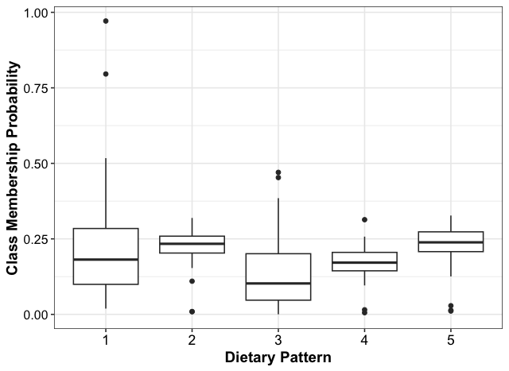{width="50%"}

### Reorder classes

If desired, we can also change the order of the classes using the `reorder_classes()` function, applied to output from `swolca()`, `swolca_var_adjust()`, `wolca()`, or `wolca_var_adjust()`. For example, we may want to order the class by most to least common in the population so that the baseline class for the regression model is the most common class. One may also want to swap classes so that more visually similar pattern profiles are displayed together.

To switch the order so the classes are ordered from most to least common, we specify `new_order = c(5, 2, 1, 4, 3)`. This will change the order so that all subsequent plotting functions will follow the new order, with the previously fifth class now displayed first. Individual class assignments will also follow the new order. That is, individuals who were previously assigned to class 5 will now be assigned to class 1, individuals who were previously class 1 will now be class 3, and individuals who were class 3 will now be class 5.

``` r
# Reorder latent classes
res_swolca_adjust <- reorder_classes(res = res_swolca_adjust, 
                                      new_order = c(5, 2, 1, 4, 3))
# Class assignments for first 3 individuals
res_swolca_adjust$estimates_adjust$c_all[1:3]
```

```         
[1] 3 2 2
```

``` r
# Pattern profiles after reordering
plot_pattern_profiles(res = res_swolca_adjust, 
                      item_labels = item_labels, item_title = item_title,
                      categ_labels = categ_labels, categ_title = categ_title,
                      class_labels = class_labels, class_title = class_title)
```

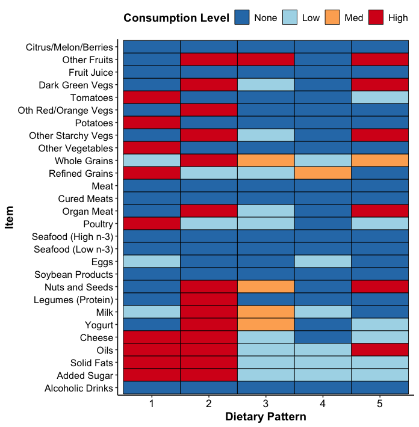{width="60%"}

### Display distribution of additional variables across classes

We can create a table to examine the distribution of additional variables across the derived classes by using the `vars_across_class()` function. For these distributions, the data are by default weighted, using the R `survey` package, so that the proportions are representative of the distribution of the variables across classes in the *population*. If desired, users can see the proportions in the *sample* by specifying `population = FALSE`.

First, we define `c_all`, the $n\times 1$ factor vector of latent class assignments obtained from the `swolca()`, `wolca()`, `swolca_var_adjust()` or `wolca_var_adjust()` functions. Factor levels should be labeled with the names that are to appear in the output table.

``` r
# Convert class assignment variable from model output to a factor
c_all <- factor(res_swolca_adjust$estimates_adjust$c_all, 
                levels = 1:5, labels = paste0("C", 1:5))
```

Next, we create dataframe `cov_df` that consists of $n$ rows containing sociodemographic variables age, race and ethnicity, physical activity, and smoking status. Factors should be labeled with the names and levels that are to appear in the output table.

``` r
# Create dataframe containing covariates to view distribution across 
# classes, editing the labels for the variable names and levels 
cov_df <- data_nhanes %>%
  select(RIDAGEYR, age_cat, racethnic, smoker, physactive) %>%
  rename(Age = RIDAGEYR) %>%
  mutate(Age_Group = factor(age_cat, levels = c(1, 2, 3), 
                            labels = c("[20, 40)", "[40, 60)", ">=60")),
         Race_Ethnicity = factor(racethnic, c(1, 2, 3, 4, 5),
                                 labels = c("NH White", "NH Black", 
                                            "NH Asian","Hispanic/Latino", 
                                            "Other/Mixed")),
         Current_Smoker = factor(smoker, levels = c(0, 1), 
                                 labels = c("No", "Yes")),
         Physical_Activity = factor(physactive, 
                                    levels = c("Inactive", "Active")),
         .keep = "unused")
```

Finally, we create a table of the distribution of age, race and ethnicity, physical activity, and smoking status in the population across five derived dietary patterns. We include the survey design variables (`sampling_wt`, `cluster_id`, `stratum_id`), which are accounted for. We want factor variables to have percentages reported as column totals (`col_props = TRUE`), displaying the population percentage in each category for a given class. If `FALSE`, row totals are used instead and display the population percentage in each class for a given category. We also specify that we want the output to be rounded to the first decimal (`digits = 1`).

The first row of the table is the proportion of the classes in the population. This is calculated using estimates of $\pi$ from `swolca_var_adjust()` to obtain the estimated percentage of individuals falling into each class in the population, accounting for survey design. The second row is the distribution of the classes in the sample.

``` r
# Obtain table displaying distribution of variables across classes
output_df <- vars_across_class(c_all = c_all, cov_df = cov_df, 
                              sampling_wt = sampling_wt, 
                              stratum_id = stratum_id, 
                              cluster_id = cluster_id, digits = 1, 
                              col_props = TRUE, res = res_swolca_adjust)
View(output_df)
```

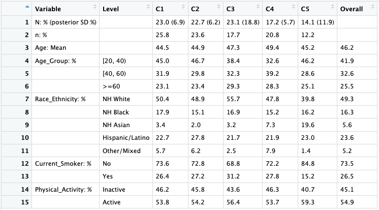{width="100%"}

### Summarize and plot the exposure-outcome relationship

To examine how the latent classes relate to the binary outcome of interest, we can display a summary of the parameter estimates by using `get_regr_coefs()`. For the one-step method (Option 2) that uses the output from `swolca()` or `swolca_var_adjust()`, this will convert the probit regression coefficients from factor reference coding to the more commonly used reference cell coding. One advantage of factor reference coding is it allows the reference class to be determined post-hoc, so any class can be chosen as the reference level for which to display regression coefficients without having to re-run the model. Simply run `reorder_classes()` with the desired reference level as the first class in `new_order`, and then run `get_regr_coefs()` as shown below.

For the two-step method (Option 1) that uses the output from `wolca_svyglm()`, the results will already be in reference cell coding. For this approach, changes to the reference class should be done by re-running the regression model with the desired reference level refactoring.

In this example, we display a summary of the probit regression coefficients using class 1 as the reference. We also display the 95% credible intervals (`ci_level = 0.95`) and round the table values to two decimal points (`digits = 2`). To save space, we only display the first 10 regression coefficients in the output.

The output shows the posterior median estimates, the lower and upper bounds of the credible intervals, and the posterior probability of the estimate being greater than 0. A posterior probability greater than 0.975 shows strong evidence for the estimate being positive, and a posterior probability less than 0.025 shows strong evidence for the estimate being negative. If using the two-step (Option 1) method with `wolca_svyglm()` output, a p-value will be shown in the last column instead.

``` r
# Get table of regression coefficients
regr_coefs <- get_regr_coefs(res = res_swolca_adjust, ci_level = 0.95, 
                             digits = 2)
regr_coefs[1:10, ]
```

```         
     Covariate Estimate    LB    UB P(xi > 0)
1  (Intercept)    -1.22 -1.94 -0.77     <0.01
2       c_all2    -0.08 -1.01  0.71      0.44
3       c_all3     0.52 -0.78  1.90      0.76
4       c_all4     0.14 -1.15  1.73      0.62
5       c_all5    -0.19 -5.52  1.23      0.38
6     age_cat2     1.11  0.21  1.85      0.98
7     age_cat3     2.07  1.29  3.80      1.00
8   racethnic2     0.31 -0.48  0.85      0.86
9   racethnic3     0.05 -1.28  1.15      0.52
10  racethnic4    -0.15 -0.66  0.57      0.26
```

To visualize the regression coefficients in the form of a boxplot, use the `plot_regr_coefs()` function. We rename the covariate labels to more interpretable names using the `cov_labels` argument. We can also modify other aspects of the plot, such as moving the legend position, by using typical arguments from the `ggplot2` package.

``` r
# Rename covariate labels
K <- res_swolca_adjust$estimates$K_red
class_dummies <- paste0("C", 2:K)
age_dummies <- paste0("Age", c("40_60", "60"))
race_dummies <- paste0("RaceEth", c("NH_Black", "NH_Asian", "Hisp", "Other"))
cov_labels <- c("Intercept", class_dummies, age_dummies, race_dummies,
                "SmokerYes", "PhysActive",
                paste0(class_dummies, ":", rep(age_dummies, each = (K - 1))),
                paste0(class_dummies, ":", rep(race_dummies, each = (K - 1))),
                paste0(class_dummies, ":", rep("SmokerYes", each = (K - 1))),
                paste0(class_dummies, ":", rep("PhysActive", each = (K - 1))))

# Get plot of regression coefficient estimates and error bars
regr_plot <- plot_regr_coefs(regr_coefs = regr_coefs, 
                             res = res_swolca_adjust, 
                             cov_labels = cov_labels)
# Display plot with legend above
regr_plot + ggplot2::theme(legend.position = "top")
```

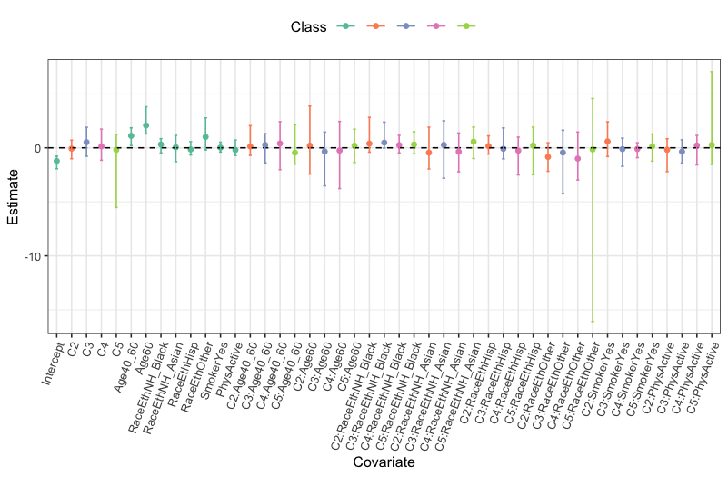{width="100%"}

Alternatively, for categorical covariates, rather than plotting the regression coefficients, we can evaluate the probit regression model at all levels of the covariate and then plot the conditional probability of the outcome using the `plot_outcome_probs()` function. This displays the probability of the outcome for the different classes, evaluated at all levels of a categorical covariate, with all other covariates evaluated at their reference level. In this example, we plot the probability of hypertension for the five dietary patterns across levels of age, with error bars for the 95% credible intervals.

``` r
# Cluster labels
class_labels <- paste0("C", 1:5) 
# Age covariate labels
age_cat_categs <- c("[20,40)", "[40,60)", ">=60") 
# Plot conditional outcome probabilities
plot_outcome_probs(res = res_swolca_adjust, cov_name = "age_cat",
                   cov_labels = age_cat_categs, class_labels = class_labels, 
                   x_title = "Age Group")
```

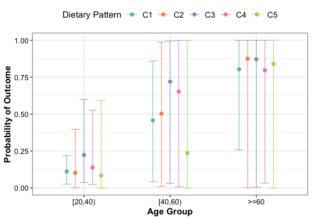{width="60%"}

We can also display the probability of outcome plots for two categorical covariates at the same time, assessing for any interactions. We can add lines connecting the points between levels of "Age" using the `add_lines = TRUE` parameter, and remove the error bars by setting `ci_level = NULL`.

``` r
# Race and ethnicity covariate labels
racethnic_categs <- c("NH White", "NH Black", "NH Asian", "Hispanic/Latino", 
                      "Other/Mixed")
# Plot two categorical covariate outcome probabilites simultaneously
p <- plot_outcome_probs(res = res_swolca_adjust, 
                        cov_name = c("age_cat", "racethnic"),
                        cov_labels = list(age_cat_categs, racethnic_categs), 
                        class_labels = class_labels, x_title = "Age Group", 
                        ci_level = NULL, add_lines = TRUE)
print(p + ggplot2::theme(axis.text.x = ggplot2::element_text(size = 9)))
```

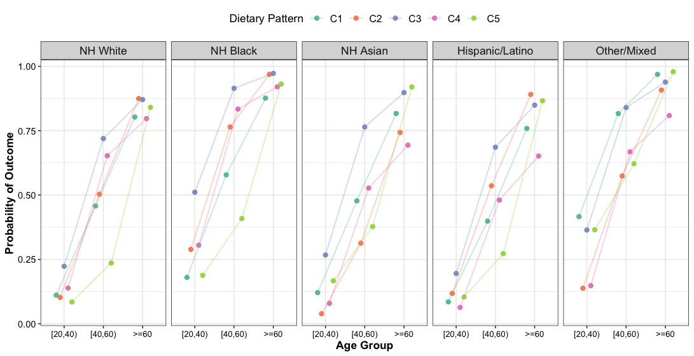{width="100%"}

## Obtain performance diagnostics and additional output {#diagnostics}

Total model runtime and the deviance information criteria (DIC) goodness-of-fit measure for model selection are available within the package using the following functions. Smaller values of DIC indicate better fit. See function documentation for more information.

``` r
# Runtime
res_swolca_adjust$runtime
```

```         
Time difference of 8.722689 mins
```

``` r
# Deviance information criteria for model goodness-of-fit
get_dic(res_swolca_adjust)
```

```         
[1] 124746.9
```

A list of the raw posterior point and interval estimates for all parameters can be obtained. We set a credible interval level of 95% and round the estimates to two digits. The possible parameters consist of:

-   $\pi_1,\ldots, \pi_K$: latent class membership probabilities for each of the $K$ underlying classes. $\pi$ parameters are returned in a vector of length $K$.
-   $\theta_{jk1}, \ldots, \theta_{jkR_j}$: exposure level probabilities ranging from 1 to $R_j$, where $R_j$ is the number of exposure levels for item $j$ out of a total of $J$ items, and $k=1,\ldots, K$. $\theta$ parameters are returned in a $JxKxR$-dimensional array.
-   $\xi_{k1}, \ldots, \xi_{kQ}$: coefficients in the binary outcome probit regression with $Q$ covariates. $\xi$ parameters are returned in a $KxQ$-dimensional matrix.

Thus, a total of $K + (J*K*R) + (K*Q) = 610$ estimates are available for this SWOLCA example, listed in order of $\pi$, then $\theta$, then $\xi$. To conserve space, we only display the first three estimates for $\pi$, $\theta$, and $\xi$ here. $\pi$ estimates are labeled with "pi_k", $\theta$ estimates are labeled with "theta_j_k_r", and $\xi$ estimates are labeled with "xi_k_q". $k$ ranges from 1 to $K$, $j$ from 1 to $J$, $r$ from 1 to $R$, and $q$ from 1 to $Q$.

``` r
# Extract summary of parameter estimates
estimates_df <- summarize_res(res = res_swolca_adjust, ci_level = 0.95, 
                              digits = 2)
# First few pi estimates
estimates_df[1:3, ]
```

```         
  Parameter Estimate Lower Bound Upper Bound
1      pi_1     0.26        0.02        0.32
2      pi_2     0.25        0.03        0.31
3      pi_3     0.20        0.03        0.73
```

``` r
# First few theta estimates
estimates_df[6:9, ]
```

```         
    Parameter Estimate Lower Bound Upper Bound
6 theta_1_1_1     0.64        0.52        0.81
7 theta_2_1_1     0.44        0.27        0.66
8 theta_3_1_1     0.44        0.37        0.50
9 theta_4_1_1     0.58        0.41        0.74
```

``` r
# First few xi estimates
estimates_df[566:569, ]
```

```         
    Parameter Estimate Lower Bound Upper Bound
566    xi_1_1    -1.22       -1.94       -0.77
567    xi_2_1    -1.27       -2.89       -0.26
568    xi_3_1    -0.76       -1.79        0.25
569    xi_4_1    -1.09       -1.99        0.07
```

We can also extract the MCMC iteration values for all parameters that were obtained through the MCMC sampler. For SWOLCA, this will be $\pi$, $\theta$, and $\xi$. For WOLCA, this will be only $\pi$ and $\theta$.

``` r
# Extract parameter MCMC iteration values
param_mcmc <- get_param_mcmc(res_swolca_adjust)
# Display first 10 iterations of pi
param_mcmc$pi_mcmc[1:10, ]
```

```         
         pi_1      pi_2       pi_3      pi_4       pi_5
1  0.21404681 0.2711999 0.07060048 0.1909269 0.25322591
2  0.22903296 0.2661842 0.28179132 0.1814540 0.04153747
3  0.25255569 0.2535889 0.31593950 0.1495266 0.02838934
4  0.21749612 0.2915196 0.27117051 0.1896920 0.03012178
5  0.29684094 0.3192869 0.15172239 0.1643078 0.06784196
6  0.21846102 0.1808988 0.43656612 0.1439221 0.02015193
7  0.01116411 0.1098699 0.41500674 0.2052747 0.25868460
8  0.16876390 0.3169399 0.11467908 0.3135302 0.08608692
9  0.25304563 0.2567038 0.27085077 0.1733324 0.04606740
10 0.25843459 0.2335444 0.18879545 0.2410795 0.07814612
```

Bayesian model diagnostics such as traceplots and autocorrelation plots can be created for all estimates to examine whether the MCMC sampler has adequately converged. For example, we display code to create traceplots and autocorrelation plots for the five class membership probability parameters, $\pi_1,\ldots, \pi_5$.

``` r
# Specify selection of pi_1 to pi_5
param_names <- colnames(param_mcmc$pi_mcmc)
# Create traceplots
create_traceplot(param_mcmc = param_mcmc, param_names = param_names)
```

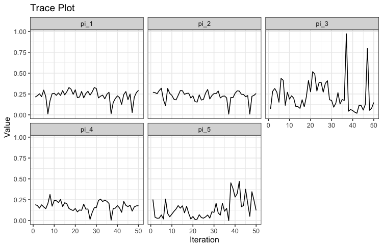{width="70%"}

``` r
# Create ACF plots
create_acfplot(param_mcmc = param_mcmc, param_names = param_names)
```

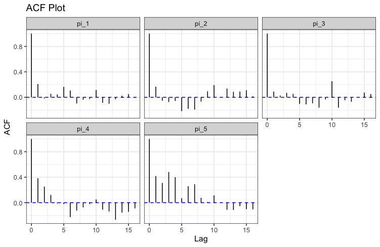{width="70%"}

# Acknowledgement

This work was supported in part by the National Institute of Allergy and Infectious Diseases (NIAID: T32 AI007358), the National Heart, Lung, and Blood Institute (NHLBI: R25 HL105400), and the Harvard Data Science Initiative $\text{Bias}^2$ Program. The authors declare no conflicts of interest.

# References
