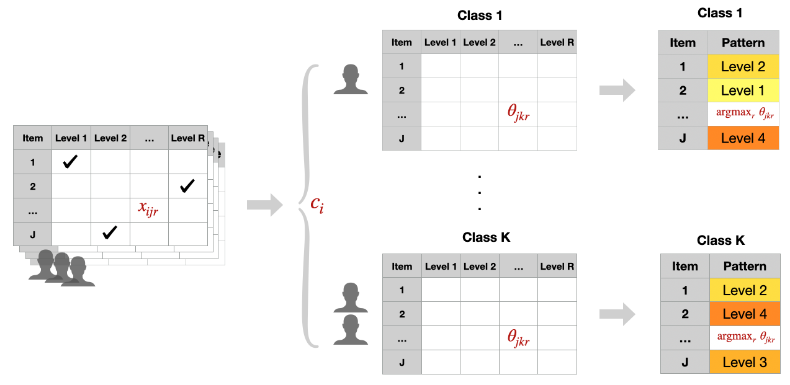

# Introduction
The `baysc` package provides functionality for running clustering analyses incorporating survey sampling weights and other survey design elements, implemented through Bayesian techniques that allow the number of clusters to be determined by the data while parameter estimation occurs. The clustering analysis implemented is a Bayesian latent class analysis (LCA) that enables elicitation of underlying pattern profiles in the setting where the correlated variables are categorical, while accounting for survey design. We use the terms "latent class" or "class" to refer to the underlying, unknown clusters that are discovered through the latent class analysis.

The `wolca()` function (Section 3.1) implements a survey-weighted Bayesian LCA and can be followed by `wolca_var_adjust()` for correct uncertainty estimation. Options also exist for relating the pattern profiles to a binary outcome. This can either be done through a two-step approach after clustering is completed using the `wolca_svyglm()` function described in Section 3.2, or in a one-step supervised approach where creation of the pattern profiles is directly informed by the outcome using the  `swolca()` function described in Section 3.3, followed by `swolca_var_adjust()` for correct uncertainty estimation. Summary and plotting functions for visualizing output are available, as are diagnostic functions for examining convergence of the MCMC sampler (Sections 4 and 5). Full statistical details for the models are provided in @wu2023derivation. 

We provide an example dataset from the National Health and Nutrition Examination Survey (NHANES) that includes dietary intake and hypertension data for low-income women in the United States, as well as survey sampling weights and information on stratification and clustered sampling in the survey design [@nchs2023homepage]. 


## Background and statistical details
### Bayesian latent class analysis
Latent class analysis (LCA), also known as a finite mixture model for categorical data, summarizes data from correlated categorical variables into a few underlying patterns that capture key differences between individuals in the data. Each individual is assigned to exactly one latent class (i.e., cluster). For each class, a pattern profile is created from the most probable category of each input variable. For instance, if the multivariate categorical input is food items consumed at levels “None”, “Low”, “Medium”, and “High”, then each class has a pattern profile consisting of the most probable consumption level for every food item among those belonging to that class, and these pattern profiles can be interpreted as dietary patterns. 

```{r pressure, echo=FALSE, fig.cap="Figure: Diagram of latent class analysis", out.width = '100%'}

```

Let $i\in \{1,\ldots,n\}$ index individuals in the sample, $j \in \{1, \ldots, J\}$ index items, and $r \in \{1, \ldots, R_j\}$ index levels for item $j$. Latent class membership is characterized by $c_i \in \{1,\ldots, K\}$ for individual $i$, where $K$ denotes the number of latent classes. Parameter $\pi_k$ is the probability of membership in class $k$, with $\sum_{k=1}^K \pi_k =1$. The exposure is a multivariate categorical variable with $J$ items, $(x_{i1}, \ldots, x_{iJ})^T$, where each item follows a Multinomial distribution with $R_j$ levels, each observed with item level probability $\theta_{jkr}$, with $\sum_{r=1}^{R}\theta_{jkr}=1$ for all $j \in \{1, \ldots, J\}$ and $k \in \{1, \ldots, K\}$. LCA relies on the local independence assumption that items are independent conditional on dietary pattern assignment, and the global clustering assumption that individuals assigned to the same pattern share behaviors for all food items. The individual complete likelihood is given by
$$
\prod_{k=1}^K \bigg\{\pi_k\prod_{j=1}^J\prod_{r=1}^{R_j}\theta_{jkr}^{I(x_{ij}=r)}\bigg\}^{I(c_i=k)}.
$$

Bayesian LCA differs from traditional LCA by allowing the number of latent classes to be chosen by the data, rather than determined by the researcher after multiple model fits. The Bayesian formulation also offers advantages when it comes to accounting for survey design with sparse data. We refer to the Bayesian LCA in this package as an overfitted LCA (OLCA) because the implementation automatically selects the number of classes by using an overfitted specification, where a conservatively high number of classes is specified and then empty and unnecessary classes drop out via a sparsity-inducing Dirichlet prior. Suppose $K_\max$ is a conservative upper bound for the number of classes (e.g., 30). Let $\pi_1,\ldots, \pi_{K_\max}$ denote the class assignment probabilities for the $K_\max$ classes. We set 
$$
(\pi_1,\ldots, \pi_{K_\max}) \sim \text{Dir}(\alpha_1,\ldots, \alpha_{K_\max})
$$
where hyperparameters $\alpha_k$ moderate the rate of growth for nonempty classes, with smaller values yielding a slower rate of growth and more sparsity. By default, we set $\alpha_k = 1/K_\max$ for all $k$, but users can specify other hyperparameter values if desired by using the `alpha_adapt` argument in the `wolca()` and `swolca()` functions. When finalizing the number of classes, we drop any classes that are duplicates, and we restrict all the classes to be above a cutoff proportion of the population using the argument `class_cutoff`. By default, we have `class_cutoff = 0.05`, which drops any classes that are observed in less than 5\% of the population. 

### Outcome modeling
Interest may also in examining the relationship between the latent class pattern profiles and a binary outcome. This can be done in two ways: 1) through a two-step "classify-analyze" approach that performs a regression after clustering is completed (Section 3.2), or 2) in a one-step approach where creation of the pattern profiles is directly informed by the outcome (Section 3.3). 

We provide brief statistical details for the one-step approach, also referred to as a supervised approach. Let $y_i$ denote the binary outcome of interest and $\boldsymbol{v}_{i\cdot}=(v_{i1},\ldots,v_{iQ})$ denote a $Q\times 1$ vector of additional regression covariates for individual $i$, corresponding to a $Q\times 1$ vector of regression coefficients $\boldsymbol{\xi}_{k\cdot} = (\xi_{k1}, \ldots, \xi_{kQ})^T$ given assignment to latent class $k$. The full set of regression coefficients can be written as a $KxQ$ matrix that follows mixture reference coding. Further details can be found in @wu2023derivation. The individual complete likelihood in the supervised setting is given by
$$
\prod_{k=1}^K \bigg\{\pi_k\prod_{j=1}^J\prod_{r=1}^{R_j}\theta_{jkr}^{I(x_{ij}=r)}\Phi(\boldsymbol{v}_{i\cdot}^T \boldsymbol\xi_{k\cdot})^{y_i}[1-\Phi(\boldsymbol{v}_{i\cdot}^T \boldsymbol\xi_{k\cdot})]^{(1-y_i)}\bigg\}^{I(c_i=k)}.
$$

### Accounting for survey design
When conducting Bayesian LCA using survey data, it is important to account for complex survey design elements such as stratification, clustered sampling, and unequal sampling probabilities. Otherwise, biased parameter estimation and inference can occur and results will lack generalizability to the broader population. To account for survey data, we implement the weighted pseudo-likelihood approaches described in @stephenson2023identifying and @wu2023derivation, based on work by @savitsky2016bayesian and @williams2021uncertainty. 

Survey weights are incorporated into parameter estimation by up-weighting each individual's likelihood contribution proportional to the number of individuals they represent in the target population, and then using this weighted pseudo-likelihood in the Bayesian posterior update. Let $\tilde{w}_i$ denote the $nx1$ vector of survey sampling weights, normalized to sum to the sample size to account for sampling uncertainty. 
$$
p_{wtd}(\theta|D) \propto p(\theta)\prod_{i=1}^n p(D_i|\theta)^{\tilde{w}_i}
$$
The posterior distributions created by this will create variance estimates that are smaller than their true value. In order to obtain accurate variance estimates, a post-processing variance adjustment proposed by @williams2021uncertainty is used post-hoc to try to recover the true variance based on pseudo-MLE theory, by applying a rescaling and reshaping transformation to the posterior estimates to obtain adjusted estimates that have approximately correct variance. 

### Parameters and variables
Below is a summary of the parameters and variables in the model formulation. 

Parameters:

- $\pi_1,\ldots, \pi_K$: latent class membership probabilities for each of the $K$ underlying classes. $\pi$ parameters are returned in a vector of length $K$.
- $\theta_{jk1}, \ldots, \theta_{jkR_j}$: exposure level probabilities ranging from 1 to $R_j$, where $R_j$ is the number of exposure levels for item $j$ out of a total of $J$ items, and $k=1,\ldots, K$. $\theta$ parameters are returned in a $JxKxR$-dimensional array. 
- $\xi_{k1}, \ldots, \xi_{kQ}$: coefficients in the binary outcome probit regression with $Q$ covariates. $\xi$ parameters are returned in a $KxQ$-dimensional matrix.

Variables:

- `x_mat`: $nxJ$ matrix of the multivariate categorical exposure, where $n$ is the number of individuals in the sample.
- `y_all`: $nx1$ vector of the binary outcome
- `w_all`: $nx1$ vector of survey weights
- `c_all`: $nx1$ vector of the underlying unobserved latent class assignment for each individual. Each individual is assigned to whichever class has the highest posterior probability.

## Package installation
The `baysc` package can be installed and loaded by running the following code. 

```{r, eval = FALSE}
# If R package `devtools` is not installed, uncomment the following line:
# `install.packages(devtools)`

# Load devtools and install baysc from GitHub
library(devtools)
devtools::install_github("smwu/baysc")
library(baysc)

# Load additional packages for this vignette
library(dplyr)
library(ggplot2)
library(knitr)
```

```{r, echo = FALSE, results = FALSE, warning = FALSE, message = FALSE}
library(devtools)
load_all()
library(baysc)
library(dplyr)
library(ggplot2)
library(knitr)
```

# NHANES example data

We begin by installing the example NHANES dataset that contains dietary intake as a multivariate categorical exposure consisting of 28 food item groups consumed at levels “None”, “Low”, “Medium”, and “High”, and hypertension as a binary outcome, for $n=2004$ low-income women in the United States. More information on the dataset preparation can be found in the data documentation and in @wu2023derivation. The package functions can also handle the scenario where the number of levels differs for different food item groups. 

To prepare the dataset, run the following code:

```{r}
# Load NHANES dataset
data("data_nhanes")
# Number of individuals
nrow(data_nhanes)
```

First, define an exposure matrix of categorical intake for each individual across 28 food groups. 

```{r}
# Exposure matrix composed of food groups
x_mat <- data_nhanes[, c("citrus", "oth_fruit", "fruit_juice", "dark_green", "tomatoes", "oth_red", "potatoes", "oth_starchy", "oth_veg", "whole_grain", "ref_grain", "meat", "cured_meats", "organ", "poultry", "seafood_high", "seafood_low", "eggs", "soybean", "nuts", "leg_protein", "milk", "yogurt", "cheese", "oils", "solid_fats", "add_sugars", "drinks")]
x_mat <- as.matrix(x_mat)
```

Second, define a binary outcome of hypertension. 
```{r}
# Outcome data on hypertension
y_all <- data_nhanes$BP_flag
```

Third, define survey design variables on stratification, clustered sampling, and sampling weights. If there is no survey design information, these variables can be left as `NULL` (default). 

```{r}
# Survey stratum indicators
stratum_id <- data_nhanes$stratum_id
# Survey cluster indicators
cluster_id <- data_nhanes$cluster_id
# Survey sampling weights
sampling_wt <- data_nhanes$sample_wt
```

Finally, create a dataframe of additional confounders to adjust for when evaluating the diet-hypertension exposure-outcome association, and define a regression formula for including these additional confounders. In this example, we adjust for age, race/ethnicity, smoking status, and physical activity.

```{r}
# Create dataframe of additional confounders
V_data <- data_nhanes %>% select(age_cat, racethnic, smoker, physactive)
# Regression formula for additional confounders
glm_form <- "~ age_cat + racethnic + smoker + physactive"
```

# Main Bayesian clustering functions for survey data
The following sections describe how to use the main functions in the `baysc` package for running survey-weighted Bayesian LCA. If no outcome information is necessary when clustering, use the unsupervised weighted OLCA, implemented in the `wolca()` function (Section 3.1). If clustering is to be informed by a binary outcome so that latent classes are found that specifically drive the outcome of interest, use the supervised weighted OLCA, implemented in the `swolca()` function (Section 3.2). 

## Clustering of categorical variables using `wolca()` and `wolca_var_adjust()`
We use the `wolca()` function to run an unsupervised weighted overfitted latent class analysis and obtain pattern profiles. The `wolca_var_adjust()` function is used after to apply a post-processing adjustment that allows for correct estimation of the variability of the parameter estimates. If this adjustment is not applied, the estimated variances will be too small. We run the sampler for 100 iterations as an example, with a total runtime of around 5 minutes for `wolca()` and `wolca_var_adjust()`. Typically, at least 20000 iterations should be used for `wolca()`, corresponding to a runtime of around 2 hours.

When running the model, there are two samplers that can be run: an adaptive sampler and a fixed sampler. The adaptive sampler is used to determine the number of latent classes using a data-driven process with a sparsity-inducing Dirichlet prior. Once the number of latent classes is determined, the fixed sampler is run using the set number of classes and produces output for estimation and inference. Note that the final number of classes determined by the fixed sampler may be smaller than the number of classes obtained from the adaptive sampler. 

```{r, eval = FALSE, warning=FALSE, cache=TRUE, results=FALSE, message = FALSE}
# Run WOLCA 
res_wolca <- wolca(x_mat = x_mat, sampling_wt = sampling_wt,
                   cluster_id = cluster_id, stratum_id = stratum_id,
                   run_sampler = "both", K_max = 30, adapt_seed = 999, 
                   class_cutoff = 0.05, n_runs = 300, burn = 150, thin = 3, 
                   update = 20, save_res = FALSE)
# Apply variance adjustment
res_wolca_adjust <- wolca_var_adjust(res = res_wolca, adjust_seed = 999,
                                     num_reps = 100, save_res = FALSE)
```

Parameters used for `wolca()`:

- `x_mat`: nxJ matrix of J categorical exposure variables for sampled individuals
- `sampling_wt`: nx1 vector of survey sampling weights 
- `cluster_id`: nx1 vector of cluster indicators from clustered sampling
- `stratum_id`: nx1 vector of stratum indicators
- `run_sampler = "both"`: Run both the adaptive and fixed sampler. If the number of latent classes is known a priori, set this to be `"fixed"`. 
- `K_max = 30`: The maximum number of latent classes is 30. Typically, the true number will be much smaller.
- `adapt_seed = 888`: Random seed for adaptive sampler. 
- `class_cutoff = 0.05`: The minimum size of each latent class should be 5\% of the population.
- `n_runs = 300`: Run the MCMC sampler for for 300 iterations. *Typically, at least 20000 iterations should be used to allow the sampler to converge.* 
- `burn = 150`: Burn-in period of 150.
- `thin = 5`: Thin the sampler to keep every 5th iteration.
- `update = 20`: Print out a MCMC progress update every 20 iterations.
- `save_res = FALSE`: Results do not need to be saved. If `save_res = TRUE`, `save_path` must also be specified and include both the desired directory and the beginning of the file name for the results. 

Parameters used for `wolca_var_adjust()`: 

- `res = res_wolca_unadj`: Results from calling `wolca()`.
- `adjust_seed = 888`: Random seed for the adjustment procedure.
- `num_reps = 100`: Use 100 bootstrap replicates to estimate variability in the sampling process.
- `save_res = FALSE`: Results do not need to be saved.

Additional parameters are available for prior specification and other customization and are described in the documentation help pages for the functions.

Users can ignore the following warning messages: "the design is sampled with replacement and only the first stage is used: and "the number of chains being less than 1 and sampling not done." Messages about negative variances and large (>1) eigenvalue differences to the nearest positive definite matrix indicate instability in the variance adjustment matrix inversions. Methods to address this issue include running the sampler for more iterations or reducing the number of additional covariate terms in the outcome regression. One could also choose to forgo the variance adjustment and simply use the posterior distributions produced by `wolca()`, acknowledging that estimated variances will be slight underestimates. 

## Two-step approach to relate pattern profiles to a binary outcome using `wolca_svyglm()`
After the pattern profiles have been created, if interest lies in relating these pattern profiles to a binary outcome, such as presence or absence of hypertension (i.e., high blood pressure), then a crude approach is to apply a two-step approach, also known as the “classify-analyze” paradigm. Step 1 involves an unsupervised clustering as described in Section 3.1. Step 2 involves a survey-weighted regression model using the `svyglm()` function in the `survey` package [@lumley2023survey]. One word of caution: this approach can result in imprecise estimates and estimates that are attenuated due to the measurement error in the first classification step that is unaccounted for. See @nylund2019prediction for more discussion of this issue. 

The following code can be used to find the association between latent classes and a binary outcome:
```{r, eval = FALSE, cache=TRUE, warning = FALSE}
# Run weighted outcome regression model
res_wolca_svyglm <- wolca_svyglm(res = res_wolca_adjust, y_all = y_all, 
                                 V_data = V_data, glm_form = glm_form, 
                                 ci_level = 0.95, save_res = FALSE)
```

Parameters used:

- `res = res_wolca_adjust`: Results from calling `wolca()` and `wolca_var_adjust()`
- `y_all`: nx1 vector of binary outcomes for sampled individuals
- `V_data`: Dataframe of additional covariates to adjust for when evaluating the exposure-outcome association. See Section 2 for an example.
- `glm_form`: String specifying the for additional covariates in the outcome regression. See Section 2 for an example. *Interaction terms between class membership and all additional covariates are automatically included as regression terms.*
- `ci_level = 0.95`: Survey-weighted confidence intervals should be evaluated at the 95\% confidence level. 
- `save_res = FALSE`: Results do not need to be saved.

The warning about negative residual degrees of freedom arises when the survey design degrees of freedom is smaller than the number of covariates in the model. Confidence intervals and p-values are by default not reported in the `svyglm()` function. However, when the covariates are not cluster-level covariates, it is approximately reasonable to use the survey design degrees of freedom instead, which is what the `baysc` package does to calculate confidence intervals and p-values. Please see the `survey` package documentation for more discussion on this issue. 

## One-step clustering of categorical variables informed by a binary outcome using `swolca()` and `swolca_var_adjust()`
As an alternative to the two-step approach in Section 3.2, a one-step “supervised” approach allows information about the binary outcome to directly inform the creation of the pattern profiles. This is advantageous for the discovery of patterns where a small subset of foods are highly influential for the outcome, and also leads to gains in precision that allow smaller exposure-outcome effects to be detected and proper propagation of the measurement error in the classification step. 

The following code can be used to run this supervised approach. We use the `swolca()` function to run a supervised weighted overfitted latent class analysis and obtain pattern profiles. The `swolca_var_adjust()` function is used after to apply a post-processing adjustment that allows for correct estimation of the variability of the parameter estimates. If this adjustment is not applied, the estimated variances will be too small. We run the sampler for 100 iterations as an example, with a total runtime of around 8 minutes for `swolca()` and `swolca_var_adjust()`. Typically, at least 20000 iterations should be used for `swolca()`, corresponding to a runtime of around 3 hours.

If continuous variables are incorporated into the binary outcome model, any such variables with standard deviation greater than 5 may result in errors in the variance adjustment. To avoid these errors, consider standardizing the variable to have mean 0 and standard deviation 1 or converting the variable into a categorical form. 

```{r, cache = TRUE, results = FALSE, warning = FALSE, message = FALSE}
# Run SWOLCA 
res_swolca <- swolca(x_mat = x_mat, y_all = y_all, V_data = V_data, 
                     glm_form = glm_form, sampling_wt = sampling_wt, 
                     cluster_id = cluster_id, stratum_id = stratum_id,  
                     run_sampler = "both", K_max = 30, adapt_seed = 888, 
                     class_cutoff = 0.05, n_runs = 300, burn = 150, thin = 3, 
                     update = 20, save_res = FALSE)
# Apply variance adjustment
res_swolca_adjust <- swolca_var_adjust(res = res_swolca, adjust_seed = 888,
                                       num_reps = 100, save_res = FALSE)
```

Parameters used for `swolca()`:

- `x_mat`: nxJ matrix of J categorical exposure variables for sampled individuals
- `y_all`: nx1 vector of binary outcomes
- `V_data`: nxQ dataframe of additional regression covariates to adjust for when evaluating the exposure-outcome association. See Section 2 for an example.
- `glm_form`: String specifying regression formula for additional covariates. See Section 2 for an example. *Interaction terms between class membership and all additional covariates are automatically included as regression terms.*
- `sampling_wt`: nx1 vector of survey sampling weights 
- `cluster_id`: nx1 vector of cluster indicators from clustered sampling
- `stratum_id`: nx1 vector of stratum indicators
- `run_sampler = "both"`: Run both the adaptive and fixed sampler. If the number of latent classes is known a priori, set this to be `"fixed"`. 
- `K_max = 30`: The maximum number of latent classes is 30. Typically, the true number will be much smaller.
- `adapt_seed = 888`: Random seed for adaptive sampler. 
- `class_cutoff = 0.05`: The minimum size of each latent class should be 5\% of the population.
- `n_runs = 300`: Run the MCMC sampler for for 300 iterations. *Typically, at least 20000 iterations should be used to allow the sampler to converge.* 
- `burn = 150`: Burn-in period of 150.
- `thin = 5`: Thin the sampler to keep every 5th iteration.
- `update = 20`: Print out a MCMC progress update every 20 iterations.
- `save_res = FALSE`: Results do not need to be saved. If `save_res = TRUE`, `save_path` must also be specified and include both the desired directory and the beginning of the file name for the results. 

Parameters used for `swolca_var_adjust()`: 

- `res = res_swolca_unadj`: Results from calling `swolca()`.
- `adjust_seed = 888`: Random seed for the adjustment procedure.
- `num_reps = 100`: Use 100 bootstrap replicates to estimate variability in the sampling process.
- `save_res = FALSE`: Results do not need to be saved.

Additional parameters are available for prior specification and other customization and are described in the documentation help pages for the functions.

Users can ignore the following warning messages: "the design is sampled with replacement and only the first stage is used: and "the number of chains being less than 1 and sampling not done." Messages about negative variances and large (>1) eigenvalue differences to the nearest positive definite matrix indicate instability in the variance adjustment matrix inversions. Methods to address this issue include running the sampler for more iterations or reducing the number of additional covariate terms in the outcome regression. If continuous covariates are included in the probit regression model, these errors may also be due to the variance of the covariate being too large. In such cases, it is recommended to reduce the variable of the covariate, either by standardizing the variable to have mean 0 and standard deviation 1, or by transforming the variable into a categorical variable. One could also choose to forgo the variance adjustment and simply use the posterior distributions produced by `swolca()`, acknowledging that estimated variances will be slight underestimates.

## Unweighted analyses
If no survey weights are available and we would like to perform analyses without accounting for survey design, we can simply use the default `weights` values of the `wolca()` and `swolca()` functions, which set all weights equal to 1. Since no survey design information is available, the `wolca_var_adjust()` and `swolca_var_adjust()` functions cannot be run and the estimates will not be correct for the broader population, only for the study sample. Variances may also be underestimated due to unaccounted-for clustered sampling. 
```{r, cache = TRUE, results = FALSE, warning = FALSE, eval = FALSE}
# Run SWOLCA without survey weights
res_swolca_unwt <- swolca(x_mat = x_mat, y_all = y_all, V_data = V_data, 
                          glm_form = glm_form, run_sampler = "both", K_max = 30,
                          adapt_seed = 888, class_cutoff = 0.05,
                          n_runs = 300, burn = 150, thin = 3, save_res = FALSE)
```

# Summarizing and plotting results
We demonstrate plotting and summarization functions using the `res_swolca_adjust` results from running SWOLCA with a variance adjustment, but the functions can also be used for the results from the other models described in Section 3. 

## Plotting the pattern profiles
For each latent class, there is a pattern profile defined by the category with the highest posterior probability, also referred to as the modal $\theta$, for each item. To visualize these pattern profiles, use the `plot_pattern_profiles` function.
```{r, fig.width = 4.5, fig.height = 7, fig.align = 'center'}
plot_pattern_profiles(res = res_swolca_adjust)
```

We can also specify labels for the items, categories, and latent classes

```{r, fig.width = 6.5, fig.height = 8, fig.align = 'center'}
# Item labels
item_title <- "Item"
item_labels <- c("Citrus/Melon/Berries", "Other Fruits", "Fruit Juice", 
                 "Dark Green Vegs", "Tomatoes", "Oth Red/Orange Vegs",
                 "Potatoes", "Other Starchy Vegs", "Other Vegetables",
                 "Whole Grains", "Refined Grains", "Meat", "Cured Meats",
                 "Organ Meat", "Poultry", "Seafood (High n-3)", "Seafood (Low n-3)",
                 "Eggs", "Soybean Products", "Nuts and Seeds", "Legumes (Protein)",
                 "Milk", "Yogurt", "Cheese", "Oils", "Solid Fats", "Added Sugar",
                 "Alcoholic Drinks")
# Category level labels
categ_title <- "Consumption Level"
categ_labels <- c("None", "Low", "Med", "High")
# Class labels
class_title <- "Dietary Pattern"
class_labels <- 1:5
# Get pattern profiles
plot_pattern_profiles(res = res_swolca_adjust, 
                      item_labels = item_labels, item_title = item_title,
                      categ_labels = categ_labels, categ_title = categ_title,
                      class_labels = class_labels, class_title = class_title)
```

For the NHANES example using the `swolca()` supervised clustering function, we can interpret these 5 patterns as diet-hypertension patterns where individuals following the same pattern share similar dietary intake and hypertension status. If the `wolca()` unsupervised clustering function had been used, these patterns would be interpreted as solely diet patterns where individuals following the same pattern share similar dietary intake. Since survey design was accounted for, these patterns should be representative of the patterns in the broader population.

To examine to what extent the data support the pattern profiles, we can view the specific distribution of posterior probabilities across the item categories for each item, for each class This allows us to examine how much evidence supports the category with the highest posterior probability compared to the other categories. If there is no evidence supporting one category over the others, then all the probabilities will be equal to $1/R_j$, where $R_j$ is the number of categories for item $j$. For example, the distribution for Item 2 for class 1 is pretty even across the 4 consumption levels, indicating that class 1 still has a fair amount of heterogeneity in consumption of Item 2. If the data strongly support a category, the posterior probability for that category will be much closer to 1 (e.g., 0.8). For example, the probability Item 14 is consumed at level "None" is very high for those in classes 4 and 5. 

```{r, fig.width = 7, fig.height = 6, fig.align = 'center'}
plot_pattern_probs(res = res_swolca_adjust)
```

## Individual class assignments
For each individual in the sample, we can obtain their final class assignment as well the posterior probability of them belonging to each class. This information can be used to check class separation metrics such as entropy [@wang2017performance] or the average latent class posterior probability [@muthen2000integrating], both recommended to be above 0.8 for adequate class separation [@weller2020latent]. Note that these metrics are NOT generalizable to the broader population and are limited to describing individuals included in the dataset. 

```{r}
# Class assignments for first 3 individuals
res_swolca_adjust$estimates_adjust$c_all[1:3]
# Posterior class probabilities for first 3 individuals, rounded to 3 decimals
round(res_swolca_adjust$estimates_adjust$pred_class_probs[1:3, ], 3)
```

A dendrogram displaying the distances between classes can also be created. The distance is the number of MCMC iterations with differing class assignments (after discarding burn-in and thinning). The dendrogram displays the hierarchical clustering setup, where individuals first are all assigned to their own class, and then classes are systematically merged together starting from classes that have the smallest distance between them. The preliminary number of latent classes selected is displayed by the rectangles, with each individual assigned to a class. A final merging step between classes that have the exact same modal pattern was done to merge any duplicate classes. 
```{r, fig.width = 5, fig.height = 4, fig.align = 'center'}
# Get dendrogram
dend <- res_swolca_adjust$post_MCMC_out$dendrogram
# Get preliminary number of latent classes
K_med <- res_swolca_adjust$post_MCMC_out$K_med
# Remove labels for individuals to declutter the plot
dend$labels <- ""
# Plot dendrogram
plot(as.dendrogram(dend), ylab = "Distance")
# Rectangles around the latent classes
rect.hclust(dend, k = K_med, border = 2:(2 + K_med - 1))
```

## Reordering classes
If desired, we can also change the order of the classes For example, if we want to switch the order so that the first class is now third and the third class is now first, we can use the `reorder_classes()` function with `new_order = c(3, 2, 1, 4, 5)`. This will change the order so that all subsequent plotting functions will follow the new order, with the previously third class now displayed first. Individual class assignments will also follow the new order. That is, individuals who were previously assigned to class 3 will now be assigned to class 1, and vice versa.   
```{r, fig.width = 5, fig.height = 8, fig.align = 'center'}
# Reorder latent classes
res_swolca_adjust <- reorder_classes(res = res_swolca_adjust, 
                                      new_order = c(3, 2, 1, 4, 5))
# Class assignments for first 3 individuals
res_swolca_adjust$estimates_adjust$c_all[1:3]
# Pattern profiles with first and third classes swapped
plot_pattern_profiles(res = res_swolca_adjust)
```

## Plotting distribution of classes
To examine how common the classes are in the broader population, the `plot_class_dist() ` function displays boxplots for the estimated proportion of the population belonging to each class (i.e., latent class membership probabilities, $\pi$) across the iterations of the MCMC sampler. 
```{r, fig.width = 5, fig.height = 4, fig.align = 'center'}
plot_class_dist(res = res_swolca_adjust)
# Median estimated population class proportions
round(res_swolca_adjust$estimates_adjust$pi_med, 3)
```

## Distribution of additional variables across classes
We can create a table to examine the distribution of additional variables across the derived classes. In this example, we create a table of the distribution of age, race and ethnicity, physical activity, and smoking status across five derived dietary patterns. For these distributions, the data are weighted so that the proportions are representative of the distribution of the variables across classes in the population. To see the proportions in the sample, specify `population = FALSE`. The proportion of the classes in the population is also displayed in this table, using the same data as the `plot_class_dist()` function.

```{r}
# Convert class assignment variable from model output to a factor
c_all <- factor(res_swolca_adjust$estimates_adjust$c_all, 
                levels = 1:5, labels = paste0("C", 1:5))
# Create dataframe containing covariates to view distribution across classes,
# editing the labels for the variable names and levels 
cov_df <- data_nhanes %>%
  select(RIDAGEYR, age_cat, racethnic, smoker, physactive) %>%
  rename(Age = RIDAGEYR) %>%
  mutate(Age_Group = factor(age_cat, levels = c(1, 2, 3), 
                            labels = c("[20, 40)", "[40, 60)", ">=60")),
         Race_Ethnicity = factor(racethnic, c(1, 2, 3, 4, 5),
                                 labels = c("NH White", "NH Black", "NH Asian",
                                            "Hispanic/Latino", "Other/Mixed")),
         Current_Smoker = factor(smoker, levels = c(0, 1), labels = c("No", "Yes")),
         Physical_Activity = factor(physactive, levels = c("Inactive", "Active")),
         .keep = "unused")
# Obtain table displaying distribution of variables across classes
output_df <- vars_across_class(c_all = c_all, cov_df = cov_df, 
                              sampling_wt = sampling_wt, stratum_id = stratum_id, 
                              cluster_id = cluster_id, digits = 1, 
                              col_props = TRUE, res = res_swolca_adjust)
knitr::kable(output_df)
```

Parameters used for `vars_across_class()`:

- `c_all`: nx1 factor vector of latent class assignments, typically obtained from the `swolca()`, `wolca()`, `swolca_var_adjust()` or `wolca_var_adjust()` functions. Factor levels should be labeled with the names that are to appear in the output table.
- `cov_df`: Dataframe with $n$ rows containing sociodemographic variables. Factors should be labeled with the names and levels that are to appear in the output table. 
- `sampling_wt`: nx1 vector of survey sampling weights 
- `cluster_id`: nx1 vector of cluster indicators for clustered sampling
- `stratum_id`: nx1 vector of stratum indicators
- `digits = 1`: Round table output to 1 decimal place
- `col_props = TRUE`: Factor variables should have percentages reported as column totals displaying the population $%$ in each category for a given class. If `FALSE`, row totals are used instead and display the population $%$ in each class for a given category. 
- `res = res_swolca_adjust`: Results from `swolca_var_adjust()` to be used to calculate the percentage of individuals falling into each class in the population, accounting for survey design.

## Summarizing and plotting the exposure-outcome relationship
To examine how the latent classes relate to the binary outcome of interest, we can first convert the regression coefficients from factor reference coding to the more commonly used reference cell coding and display a summary of the parameter estimates. One advantage of factor reference coding is it allows the reference class to be determined post-hoc, so any class can be chosen as the reference level for which to display regression coefficients without having to re-run the model. Simply run `reorder_classes()` with the desired reference level as the first class in `new_order`, and then run `get_regr_coefs()` as shown below.
Note that this is *not* possible with the two-step `wolca_svyglm()` method. Please re-run `wolca_svyglm()` with the desired reference level refactoring  

In this example, we display a summary of the probit regression coefficients using class 1 as the reference. We also display the 95\% credible intervals (`ci_level = 0.95`) and round the table values to two decimal points (`digits = 2`). To save space, we only display the first 10 regression coefficients in the output. 

```{r}
# Get table of regression coefficients
regr_coefs <- get_regr_coefs(res = res_swolca_adjust, ci_level = 0.95, digits = 2)
regr_coefs[1:10, ]
```

To visualize this in the form of a boxplot, use the `plot_regr_coefs()` function.

```{r, fig.width = 7, fig.height = 5, fig.align = 'center'}
plot_regr_coefs(regr_coefs = regr_coefs, res = res_swolca_adjust)
```

If we want to change the labels for the covariates, we can do so with the `cov_labels` argument. We can also modify other aspects of the plot, such as moving the legend position, by using typical arguments from the `ggplot2` package. 

```{r, fig.width = 7, fig.height = 5, fig.align = 'center'}
# Define new vector of covariate labels
class_dummies <- paste0("C", 2:5)
age_dummies <- paste0("Age", c("40_60", "60"))
race_dummies <- paste0("RaceEth", c("NH_Black", "NH_Asian", "Hisp", "Other"))
cov_labels <- c("Intercept", class_dummies, age_dummies, race_dummies,
                "SmokerYes", "PhysActive",
                paste0(class_dummies, ":", rep(age_dummies, each = 4)),
                paste0(class_dummies, ":", rep(race_dummies, each = 4)),
                paste0(class_dummies, ":", rep("SmokerYes", each = 4)),
                paste0(class_dummies, ":", rep("PhysActive", each = 4)))
# Get plot of regression coefficient estimates and error bars
regr_plot <- plot_regr_coefs(regr_coefs = regr_coefs, res = res_swolca_adjust, 
                             cov_labels = cov_labels)
# Display plot with legend above
regr_plot + ggplot2::theme(legend.position = "top")
```

Alternatively, for categorical covariates, rather than plotting the regression coefficients, we can evaluate the probit regression model at all levels of the covariate and then plot the conditional probability of the outcome using the `plot_outcome_probs()` function. This displays the probability of the outcome for the different classes, evaluated at all levels of a categorical covariate, with all other covariates evaluated at their reference level. In this example, we plot the probability of hypertension for the five dietary patterns across levels of age, with error bars for the 95\% credible intervals. 

```{r, fig.width = 5, fig.height = 4, fig.align = 'center'}
class_labels <- paste0("C", 1:5)
age_cat_categs <- c("[20,40)", "[40,60)", ">=60")
plot_outcome_probs(res = res_swolca_adjust, cov_name = "age_cat",
                   cov_labels = age_cat_categs, class_labels = class_labels, 
                   x_title = "Age Group")
```

We can also display the probability of outcome plots for two categorical covariates at the same time, assessing for any interactions. We can add lines connecting the points between levels of "Age" using the `add_lines = TRUE` parameter, and remove the error bars by setting `ci_level = NULL`. 

```{r, fig.width = 7, fig.height = 5, fig.align = 'center'}
racethnic_categs <- c("NH White", "NH Black", "NH Asian", "Hispanic/Latino", 
                      "Other/Mixed")
p <- plot_outcome_probs(res = res_swolca_adjust, cov_name = c("age_cat", "racethnic"),
                        cov_labels = list(age_cat_categs, racethnic_categs), 
                        class_labels = class_labels, x_title = "Age Group", 
                        ci_level = NULL, add_lines = TRUE)
print(p + ggplot2::theme(axis.text.x = ggplot2::element_text(size = 9)))
```


## Runtime, model fit, and extracting parameter estimates
We can obtain other summary information such as the total runtime for the model, the deviance information criteria to assess model goodness-of-fit for model selection, as well as a list of the raw point and interval estimates for all parameters, specifying the confidence or credible interval level. Here, we use a 95\% credible interval and round the estimates to two digits. A total of $K + (J*K*R) + (K*Q) = 610$ estimates are available for this example but we only display the first three estimates for $\pi$, $\theta$, and $\xi$ to save space. $\pi$ estimates are labeled with "pi_k", $\theta$ estimates are labeled with "theta_j_k_r", and $\xi$ estimates are labeled with "xi_k_q". $k$ ranges from 1 to $K$, $j$ from 1 to $J$, $r$ from 1 to $R$, and $q$ from 1 to $Q$.

```{r}
# Runtime
res_swolca_adjust$runtime
# Deviance information criteria for model goodness-of-fit
get_dic(res_swolca_adjust)
# Extract summary of parameter estimates
estimates_df <- summarize_res(res = res_swolca_adjust, ci_level = 0.95, digits = 2)
# First few pi estimates
estimates_df[1:3, ]
# First few theta estimates
estimates_df[6:9, ]
# First few xi estimates
estimates_df[566:569, ]
```

We can also extract the MCMC iteration values for all parameters that were obtained through the MCMC sampler. For SWOLCA, this will be $\pi$, $\theta$, and $\xi$. For WOLCA, this will be only $\pi$ and $\theta$.

```{r}
# Extract parameter MCMC iteration values
param_mcmc <- get_param_mcmc(res_swolca_adjust)
# Display first 10 iterations of pi
param_mcmc$pi_mcmc[1:10, ]
```

# Diagnostics
Traceplots and autocorrelation plots can be created for all estimates to examine whether the MCMC sampler has adequately converged. For example, we display code to create traceplots and autocorrelation plots for the five class membership probability parameters, $\pi_1,\ldots, \pi_5$. 
```{r, fig.width = 5, fig.height = 4, fig.align = 'center'}
# Specify selection of pi_1 to pi_5
param_names <- colnames(param_mcmc$pi_mcmc)
# Create traceplots
create_traceplot(param_mcmc = param_mcmc, param_names = param_names)
# Create ACF plots
create_acfplot(param_mcmc = param_mcmc, param_names = param_names)
```

# References
